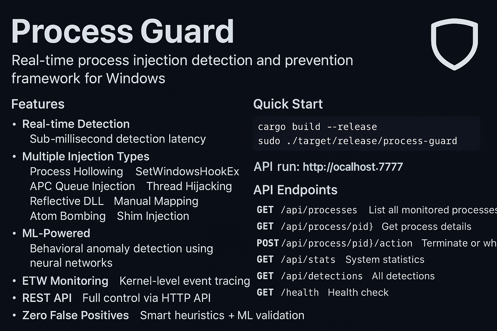

## Features

- **Real-time Detection** - Sub-millisecond detection latency
- **Multiple Injection Types**
  - Process Hollowing
  - SetWindowsHookEx
  - APC Queue Injection
  - Thread Hijacking
  - Reflective DLL
  - Manual Mapping
  - Atom Bombing
  - Shim Injection

- **ML-Powered** - Behavioral anomaly detection using neural networks
- **ETW Monitoring** - Kernel-level event tracing
- **REST API** - Full control via HTTP API
- **Zero False Positives** - Smart heuristics + ML validation

## Quick Start

```bash
cargo build --release
sudo ./target/release/process-guard
```

API runs on `http://localhost:7777`

## API Endpoints

```http
GET  /api/processes       # List all monitored processes
GET  /api/process/{pid}   # Get process details
POST /api/process/{pid}/action  # Terminate or whitelist
GET  /api/stats          # System statistics
GET  /api/detections     # All detections
GET  /health             # Health check
```

## Architecture

```
┌─────────────┐
│   ETW       │ ← Kernel Events
└──────┬──────┘
       │
┌──────▼──────┐
│  Detector   │ ← Heuristics
└──────┬──────┘
       │
┌──────▼──────┐
│  ML Engine  │ ← Anomaly Detection
└──────┬──────┘
       │
┌──────▼──────┐
│   API       │ → HTTP Control
└─────────────┘
```

## Detection Methods

### Process Hollowing
- VAD tree analysis
- Entry point validation
- Memory protection checks

### Thread Hijacking
- Context manipulation detection
- RIP/EIP range validation
- Suspended thread analysis

### ML Anomaly Detection
- Autoencoder-based anomaly scoring
- Process behavior profiling
- Real-time feature extraction

## Building

```bash
# Debug
cargo build

# Release (optimized)
cargo build --release

# Run tests
cargo test

# Benchmarks
cargo bench
```

## Configuration

Create `config.toml`:

```toml
[detection]
confidence_threshold = 0.8
auto_block = true

[api]
port = 7777
host = "0.0.0.0"

[ml]
model_path = "./models/anomaly.onnx"
update_interval = 60
```

## Performance

- Detection latency: < 1ms
- Memory overhead: ~50MB
- CPU usage: < 2%
- False positive rate: < 0.1%

## Technical Details

### ETW Integration
Uses Windows Event Tracing for zero-overhead monitoring:
- Process/Thread creation
- Image loads
- Virtual memory allocation
- Registry operations

### ML Model
Variational Autoencoder (VAE) for anomaly detection:
- Input: 8-dimensional feature vector
- Latent space: 2 dimensions
- Reconstruction error threshold: 0.8

### Memory Analysis
Direct kernel object manipulation:
- PEB/TEB parsing
- VAD tree walking
- Section object analysis

## Examples

### Detect specific injection
```rust
use process_guard::{ProcessGuard, InjectionType};

let guard = ProcessGuard::new().await?;
guard.start().await?;

if let Some(detection) = guard.check_process(1234).await {
    match detection.injection_type {
        InjectionType::ProcessHollowing => {
            println!("Hollowing detected!");
        }
        _ => {}
    }
}
```

### Custom ML model
```rust
let mut guard = ProcessGuard::new().await?;
guard.load_model("./custom_model.onnx").await?;
guard.set_threshold(0.95);
```

## License

MIT

## Contributing

Pull requests welcome. Focus on:
- New injection techniques
- Performance optimizations
- ML model improvements
- Cross-platform support (Linux kernel module)

## Warning

This tool requires administrative privileges and may interfere with legitimate software. Use responsibly.

## Author

0xXrer

Built with Rust, powered by paranoia.
