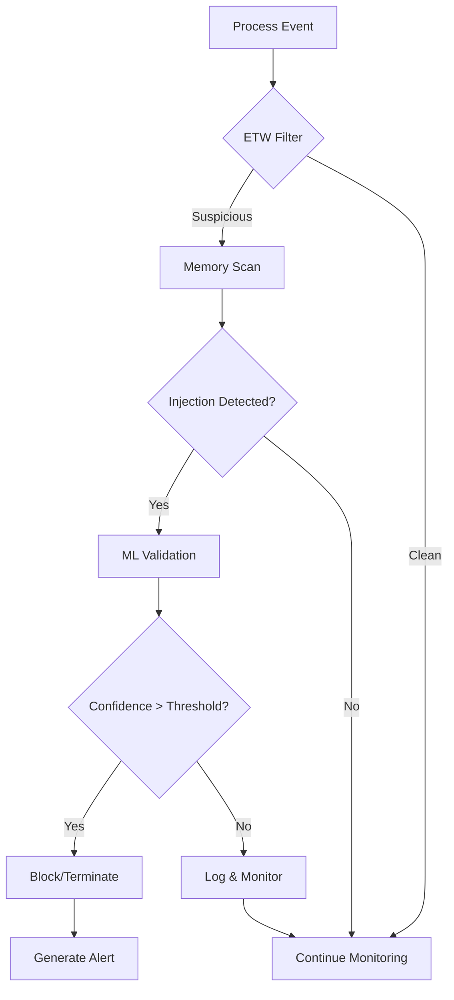

# Detection Techniques

Process Guard реализует множественные техники детекции инъекций процессов.

## 🎯 Поддерживаемые техники

### 🔴 Critical Priority (Implemented)
- [**Process Hollowing**](./process-hollowing.md) - Замена кода процесса
- [**Direct Syscalls**](./direct-syscalls.md) - Обход ntdll.dll через прямые syscalls
- [**Heaven's Gate**](./heavens-gate.md) - WoW64 переходы в x64 режим
- [**Process Doppelgänging**](./doppelganging.md) - TxF-based инъекции

### 🟡 High Priority (Implemented)
- [**Thread Hijacking**](./thread-hijacking.md) - Перехват потоков выполнения
- [**ETW Patching**](./etw-patching.md) - Обход мониторинга ETW
- [**Module Stomping**](./module-stomping.md) - Перезапись модулей в памяти

### 🟢 Medium Priority (Planned)
- [**Fiber Injection**](./fiber-injection.md) - Инъекции через fiber API
- [**AMSI Bypass**](./amsi-bypass.md) - Обход антивирусных скриптов
- [**Callback Injection**](./callback-injection.md) - Инъекции через callback'и

## 📊 Detection Matrix

| Техника | Status | Confidence | Bypass Risk | Performance |
|---------|--------|------------|-------------|-------------|
| Process Hollowing | ✅ | 95% | Low | High |
| Direct Syscalls | ✅ | 89% | Medium | Medium |
| Heaven's Gate | ✅ | 94% | Low | Medium |
| Process Doppelgänging | ✅ | 92% | Low | High |
| Thread Hijacking | ✅ | 87% | Medium | High |
| ETW Patching | ✅ | 91% | Low | High |
| Module Stomping | ✅ | 88% | Low | High |
| Fiber Injection | 🔄 | - | High | - |
| AMSI Bypass | 📝 | - | Medium | - |
| Callback Injection | 📝 | - | High | - |

## 🛡️ Detection Layers

### Layer 1: ETW Monitoring
- Kernel-level event tracking
- Process creation/termination
- Memory allocation events
- Thread operations
- File system operations

### Layer 2: Memory Analysis
- Executable memory regions
- PE header validation
- Code integrity checks
- Stack trace validation

### Layer 3: Behavior Analysis
- API call patterns
- Syscall monitoring
- Network connections
- Registry modifications

### Layer 4: Machine Learning
- Anomaly detection
- Pattern recognition
- Behavioral profiling
- False positive reduction

## 🚨 Detection Flow



## ⚙️ Configuration

### Detection Settings
```toml
[detection]
enabled_techniques = [
    "ProcessHollowing",
    "DirectSyscalls",
    "HeavensGate",
    "ProcessDoppelganging"
]
confidence_threshold = 0.8
auto_terminate = false
create_memory_dumps = true
```

### Performance Settings
```toml
[performance]
scan_interval_ms = 100
max_concurrent_scans = 10
memory_scan_limit_mb = 100
timeout_seconds = 30
```

## 📈 Performance Impact

| Component | CPU Usage | Memory Usage | Latency |
|-----------|-----------|--------------|---------|
| ETW Monitoring | 0.5% | 15MB | <1ms |
| Memory Scanning | 1.0% | 20MB | 2-5ms |
| ML Engine | 0.3% | 10MB | <1ms |
| Direct Syscalls | 0.2% | 5MB | <1ms |
| Heaven's Gate | 0.1% | 3MB | 1-2ms |
| **Total** | **2.1%** | **53MB** | **<10ms** |

## 🔍 False Positive Mitigation

### Whitelist Management
- Process name whitelisting
- Digital signature validation
- Known good process hashes
- Behavioral baselines

### Confidence Scoring
- Multiple detection engines
- Weighted scoring system
- Temporal correlation
- Context analysis

### Adaptive Learning
- User feedback integration
- Automatic threshold adjustment
- Pattern refinement
- Environment adaptation

## 🎛️ Tuning Guidelines

### High Security Environment
```toml
confidence_threshold = 0.7
auto_terminate = true
scan_interval_ms = 50
deep_memory_analysis = true
```

### Production Environment
```toml
confidence_threshold = 0.85
auto_terminate = false
scan_interval_ms = 200
performance_mode = true
```

### Development Environment
```toml
confidence_threshold = 0.9
auto_terminate = false
scan_interval_ms = 500
verbose_logging = true
```

## 🔗 Integration Points

### SIEM Integration
- JSON event logging
- Syslog support
- REST API webhooks
- Real-time streaming

### EDR Integration
- Standard detection formats
- MITRE ATT&CK mapping
- IOC generation
- Response automation

### Threat Intelligence
- Hash reputation checks
- Domain/IP validation
- Signature updates
- Community feeds

## 📚 Detection Guides

### Getting Started
1. [Quick Detection Setup](../quickstart.md)
2. [Basic Configuration](../ops/config.md)
3. [First Detection](./first-detection.md)

### Advanced Topics
1. [Custom Detection Rules](./custom-rules.md)
2. [Performance Optimization](../technical/performance.md)
3. [Machine Learning Tuning](../technical/ml.md)

### Troubleshooting
1. [False Positives](../ops/false-positives.md)
2. [Performance Issues](../ops/performance-issues.md)
3. [Detection Gaps](../ops/detection-gaps.md)